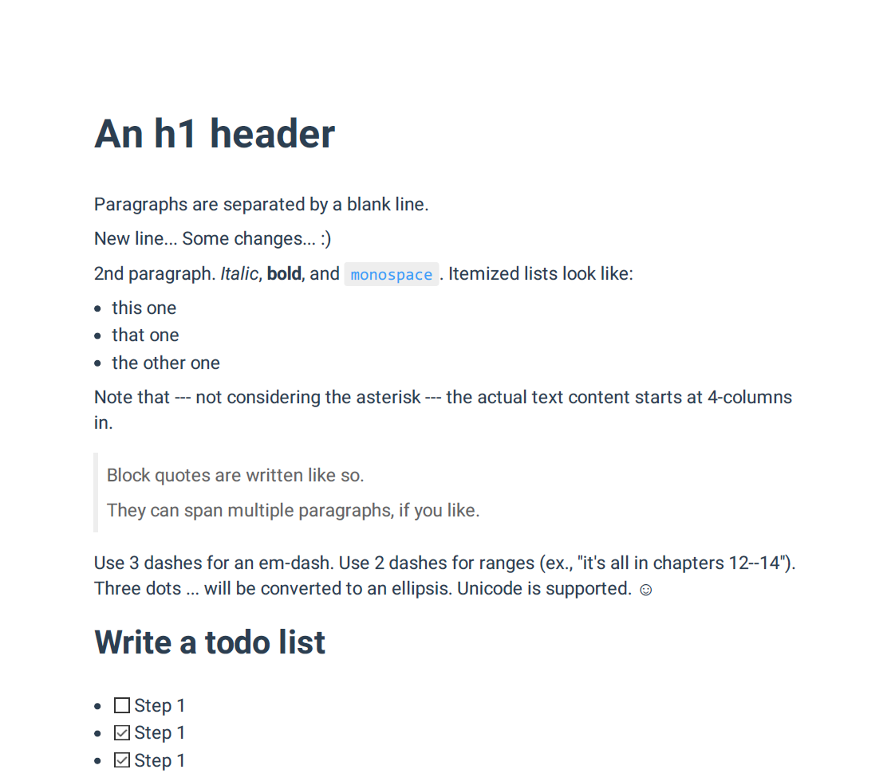
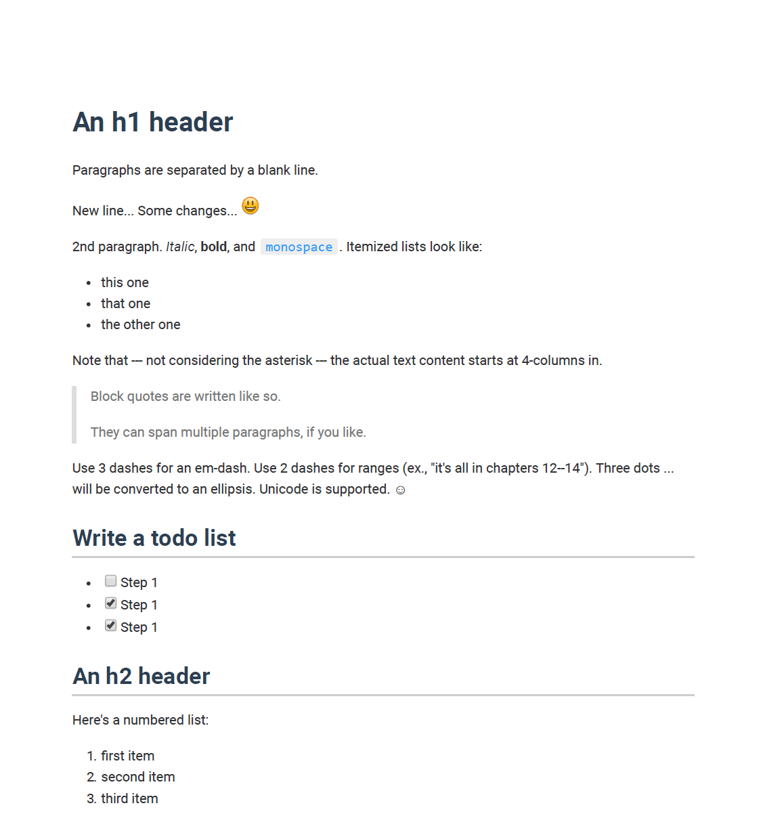

# markdown-css

This is my own markdown style. 
And it also works for chinese(中文可用).

I've made versions for `atom` and `vscode`.
But, there are some difference between these them.
The biggest difference is the font size.(you can modify it easily)

Also, I've a version that seems work for both or even more. 
Just want to clarify this version is mostly copied from others while I forget where I download.

This is mostly made for converting to pdf, so not sure for other uses.

## Example

You could view example in `example/example-atom.pdf` and `example/example-vscode.pdf`.

The example is copied from `markdown-themeable-pdf` installed in Atom.

### Screenshots

**Atom**

**VSCode**

## Usage

### Atom

I'm using `markdown-themeable-pdf`, you could find the default custom style path in the setting.
It should be `~/.atom/markdown-themeabl-pdf/style.css`.

Highlighting theme is `color-brewer.css`.

### VS Code

I'm using `Markdown PDF`.
Scroll down to the setting of it, add your css file in `Styles`.

`markdown-style-vscode` is for including default style(I recommend it).

`markdown-style-common` is for excluding defult style(but there will some error like rendering emoji every large).

## Font

I'm using `Roboto` as main font. You may download and install it from google font.

As for Chinese, I use `微软雅黑`.

Since, I'm using Windows, you may modify font if you use Mac or Linux.